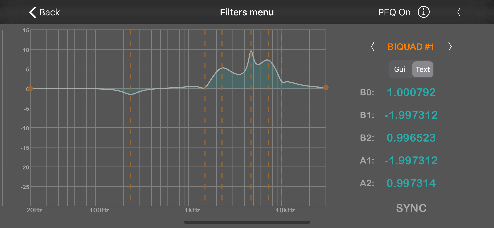

# HPToy IOS application

HPToy is a headphone amplifier system with E1DA PowerDac V2(.1) wireless control. The app allows controlling of plenty of DSP functions in an intuitive manner. Yep, complex things getting easier today: Crossovers adjustment, parametric EQ's, Bass&Treble, Compressor, Loudness, preset sharing, and more.

You can download application from Apple market:
https://apps.apple.com/us/app/hptoy/id1451536488

